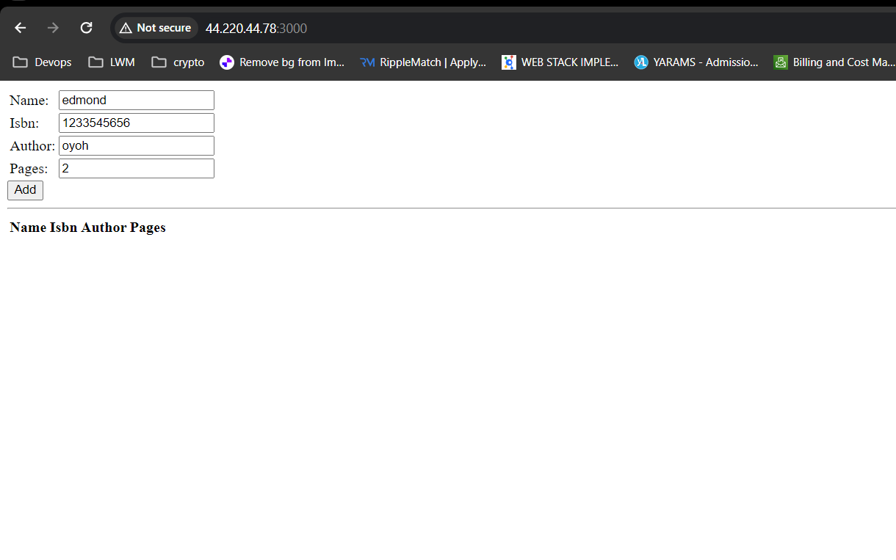
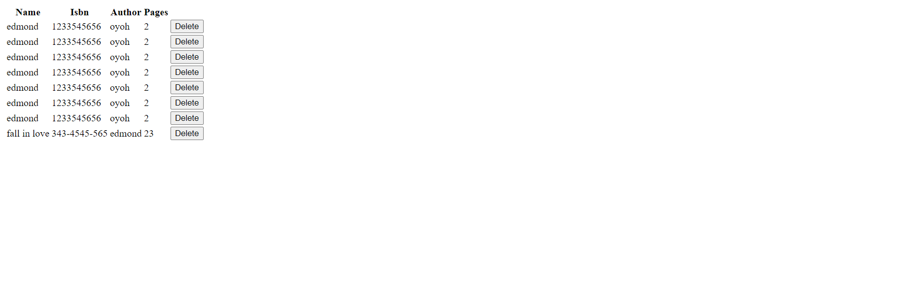

#  Deploying a simple Book Register web form using the MEAN stack.

The MEAN stack is a popular choice for building dynamic web applications. It leverages a combination of JavaScript technologies:

MongoDB: A NoSQL document database for flexible data storage. 
Express.js: A lightweight web framework for Node.js that simplifies building APIs and web applications. 
AngularJS: A powerful framework for creating interactive user interfaces. 
Node.js: A JavaScript runtime environment that allows execution of server-side JavaScript code. 

   

This documentation provides a comprehensive overview of setting up and utilizing each component of the MEAN stack to develop the Book Register web applications.

# Prerequisites
- AWS Account
- Launch EC2 with Ubuntu
- MongoDB atlas Account

# Setup a MERN Stack on Ubuntu
- Install npm
- install express
- Install Node
- Input react
- Install axios
- Install body-parser

