# Deploying a Simple Book Registeration Form using MEAN STACKS ON EC2

## Introduction

The MERN stack consists of MongoDB, Express, React / Redux, and Node.js. The MERN stack is one of the most popular JavaScript stacks for building modern single-page web applications.

**This guide demonstrates how to build a todo application that uses a RESTful API on an Ubuntu 20.04 server using EC2**

## Step 0

1. EC2 Instance of t2.nano type and Ubuntu 22.04 LTS (HVM) was lunched in the us-east-1 region using the AWS console

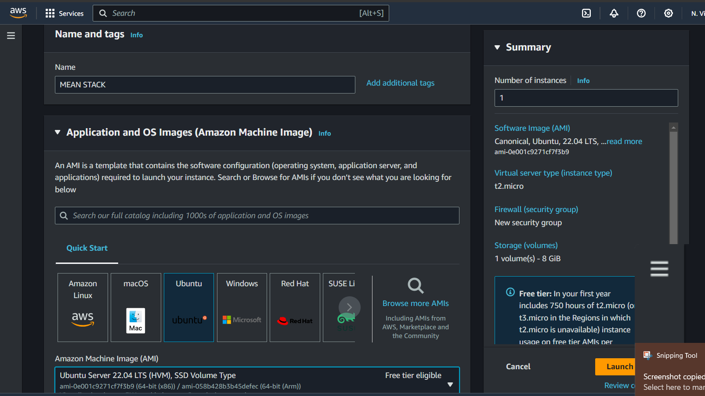
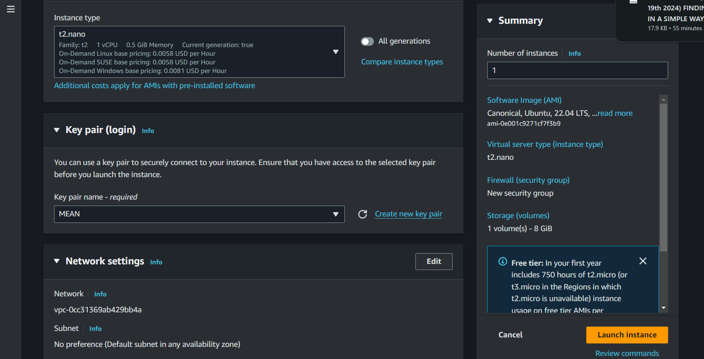<br><br>

2. The security group was configured with the following inbound rules:

- Allow traffic on port 80 (HTTP) with source from anywhere on the internet.
- Allow traffic on port 443 (HTTPS) with source from anywhere on the internet.
- Allow traffic on port 22 (SSH) with source from any IP address. This is opened by default.
- Allow traffic on port 5000 with source from any IP address.
- Allow traffic on port 3000 with source from any IP address.
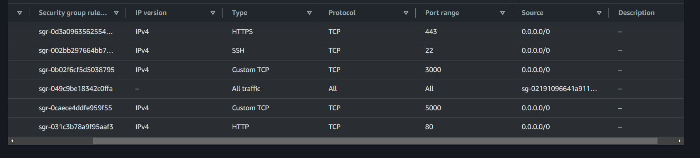<br><br>

3. Let's Connect our instance using SSH, then `cd` into the folder where the `private-key` was downloaded then ssh into it

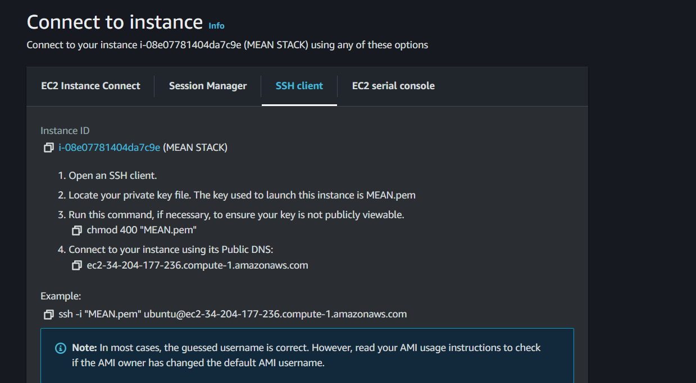<br><br>

```bash
$ cd desktop

$ chmod 400 MEAN.pem

ssh -i "MEAN.pem" ubuntu@ec2-34-227-7-216.compute-1.amazonaws.com
```

<br>


## Step 1 - Setup Node Server

1. Update and upgrade list of packages in package manager

```bash
sudo apt update
sudo apt upgrade -y
```


2. Locate the Node.js software from [Ubuntu repositories](https://github.com/nodesource/distributions#deb).

```bash
curl -fsSL https://deb.nodesource.com/setup_18.x | sudo -E bash -
```


3. Install Node.js on the server

```bash
sudo apt-get install -y nodejs
```

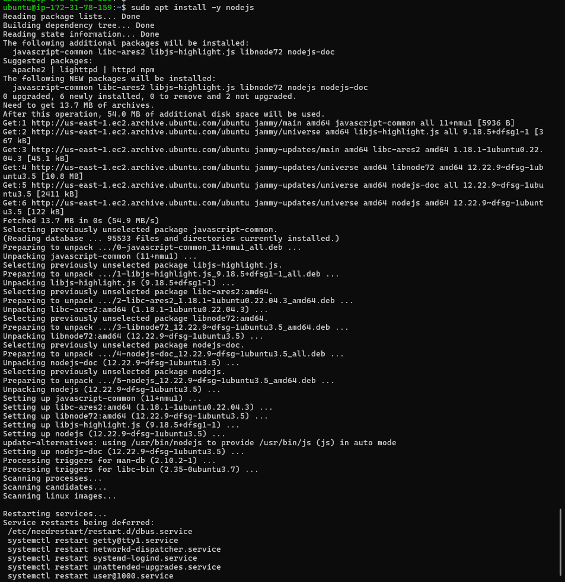<br><br>

_The above command installs both nodejs and npm(node modules)_

## Step 1 - Setup MongoDB & Set up Server
1. Install MongoDB

```bash
wget -qO - https://www.mongodb.org/static/pgp/server-6.0.asc | sudo apt-key add -
echo "deb [ arch=amd64,arm64 ] https://repo.mongodb.org/apt/ubuntu focal/mongodb-org/6.0 multiverse" | sudo tee /etc/apt/sources.list.d/mongodb-org-6.0.list

```

```bash
sudo apt-get update

sudo apt-get install -y mongodb-org
```

2. Verify that the service is up and running 

```bash
sudo systemctl start mongod
sudo systemctl enable mongod
sudo systemctl status mongod
```
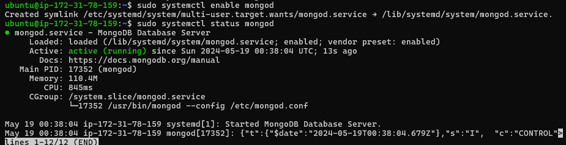<br><br>

3. install node package

```bash 
sudo apt install -y npm 
```

4. install body-parser package

```bash
sudo npm install body-parser
```

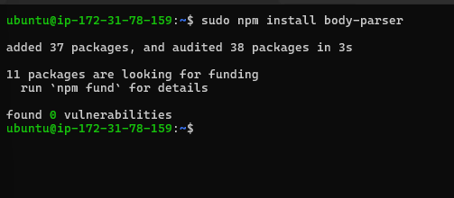<br><br>

5. create a folder named `Books`

```bash
$ mkdir Books && cd Books
```

6. In the `Books` directory, initialize npm project

```bash
npm init
```
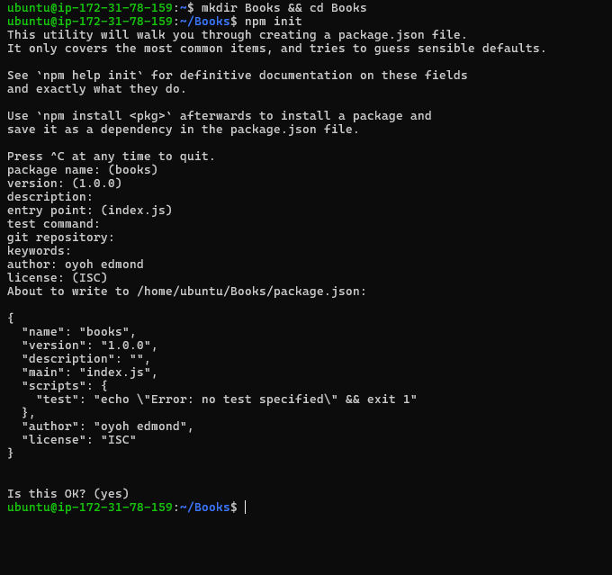<br><br>

7. Add a file named `server.js`

```bash 
nano server.js
```
Copy and paste 

```bash
var express = require('express');
var bodyParser = require('body-parser');
var app = express();
app.use(express.static(__dirname + '/public'));
app.use(bodyParser.json());
require('./apps/routes')(app);
app.set('port', 3000);
app.listen(app.get('port'), function(){
    console.log('Server up: http://localhost:' + app.get('port'));
});
```

## Step 2 - Install Express and Setup Routes to the server

1. Install Express & Mongoose
```bash
sudo npm install express 
sudo apt install mongoose
```
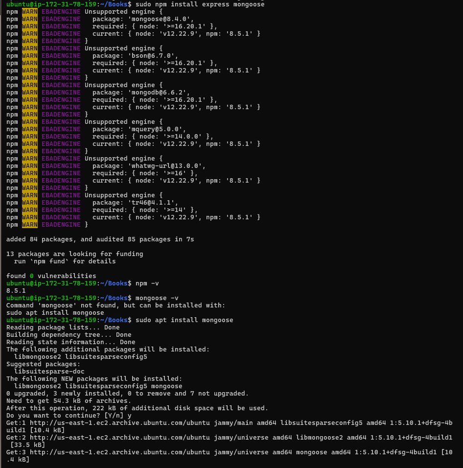<br><br>

2. Create `apps` folder inside the books directory

```bash
$ mkdir apps && cd apps
```

3. Create a `routes.js` file inside apps directory
```bash
vi routes.js
```

then paste this code inside

```bash 
var Book = require('./models/book');
module.exports = function(app){
    app.get('/book', function(req,res){
        Book.find({}, function(err, result){
            if(err) throw err;
            res.json(result);
        });
    });
    app.post('/book', function(req, res){
        var book = new Book({
            name:req.body.name,
            isbn:req.body.isbn,
            author:req.body.author,
            pages:req.body.pages
        });
        book.save(function(err, result){
            if(err)throw err;
            res.json({
                message:"Successfully added book",
                book:result
            });
        });
    });
    app.delete("/book/:isbn", function(req, res){
        Book.findOneAndRemove(req.query, function(err,result){
            if(err) throw err;
            res.json({
                message: "Successfully deleted the book",
                book: result
            });
        });
    });
    var path = require('path');
    app.get('*', function(req,res){
        res.sendfile(path.json(__dirname + '/public', 'index.html'));
    });
};
```

<br><br>


4. make an `models` folder inside `apps` folder

```bash
mkdir models && cd models
```

5. Create a `book.js` file inside `models` directory 
```bash
vi book.js
```

Copy these code inside

```bash
var mongoose = require('mongoose');
var dbHost = 'mongodb://localhost:27017/test';
mongoose.connect(dbHost);
mongoose.connection;
mongoose.set('debug', true);
var bookSchema = mongoose.Schema({
    name: String,
    isbn: {type: String, index: true},
    author: String,
    pages: Number
});
var Book = mongoose.model('Book', bookSchema);
module.exports = mongoose.model('Book', bookSchema);
```
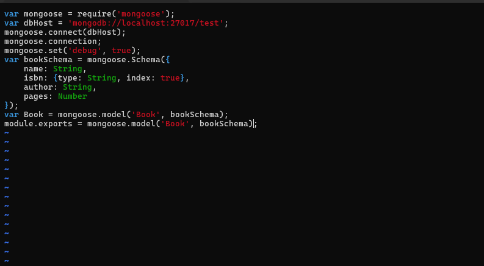<br><br>


## Step 3 - Access the routes with AngularJs

Change the directory back to `books`
```bash
cd ../.. 
```
1. Create a `public` folder
```
mkdir public && cd public
```
2. create a `script.js` file inside of the folder

```bash
vi script.js
```

and copy this code inside

```bash
var app = angular.module('myApp', []);
app.controller('myCtrl', function($scope, $http) {
    // Fetch books from the server
    $http({
        method: 'GET',
        url: '/book'
    }).then(function successCallback(response) {
        $scope.books = response.data;
    }, function errorCallback(response) {
        console.log('Error:' + response);
    });

    // Delete a book
    $scope.del_book = function(book) {
        $http({
            method: 'DELETE',
            url: '/book/' + book.isbn // Use book.isbn directly in the URL
        }).then(function successCallback(response) {
            console.log(response);
            // Optionally, refresh the book list or remove the deleted book from $scope.books
        }, function errorCallback(response) {
            console.log('Error:' + response);
        });
    };

    // Add a new book
    $scope.add_book = function() {
        var body = {
            name: $scope.Name,
            isbn: $scope.Isbn,
            author: $scope.Author,
            pages: $scope.Pages
        };

        $http({
            method: 'POST', // Changed to POST for adding a book
            url: '/book',
            data: body,
            headers: {
                'Content-Type': 'application/json' // Set the content type to JSON
            }
        }).then(function successCallback(response) {
            console.log(response);
            // Optionally, refresh the book list or add the new book to $scope.books
        }, function errorCallback(response) {
            console.log('Error:' + response);
        });
    };
});

```
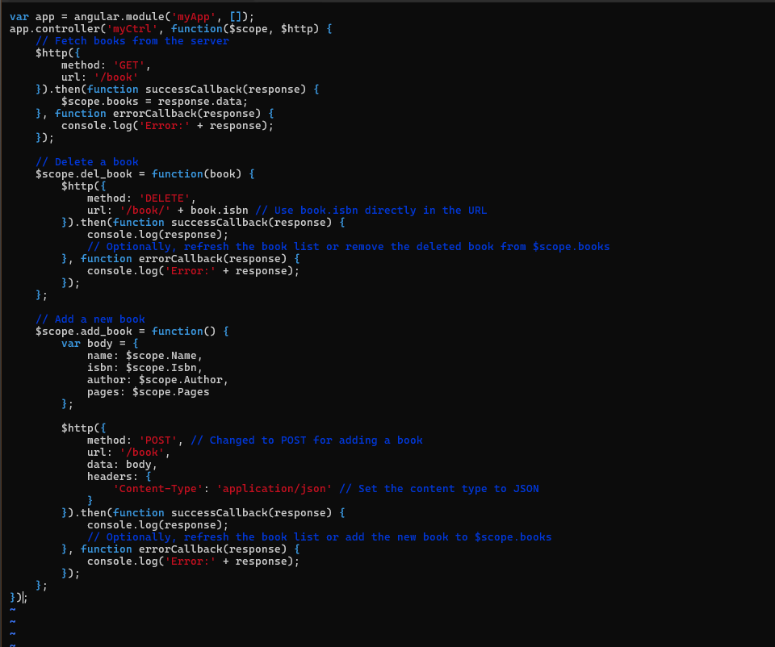<br><br>

3. Create a  `index.html` file

```bash
vi index.html
```

copy the code inside

```bash 
<!doctype html>
<html ng-app="myApp" ng-controller="myCtrl">
<head>
    <script src="https://ajax.googleapis.com/ajax/libs/angularjs/1.6.4/angular.min.js"></script>
    <script src="script.js"></script>
</head>    
    <body>
        <div>
            <table>
                <tr>
                    <td>Name:</td>
                    <td><input type="text" ng-model="Name"></td>
                </tr>
                <tr>
                    <td>Isbn:</td>
                    <td><input type="text" ng-model="Isbn"></td>
                </tr>
                <tr>
                    <td>Author:</td>
                    <td><input type="text" ng-model="Author"></td>
                </tr>
                <tr>
                    <td>Pages:</td>
                    <td><input type="text" ng-model="Pages"></td>
                </tr>
            </table>
            <button ng-click="add_book()">Add</button>
        </div>
        <hr>
        <div>
            <table>
                <tr>
                    <th>Name</th>
                    <th>Isbn</th>
                    <th>Author</th>
                    <th>Pages</th>
                </tr>

                <tr ng-repeat="book in books">
                    <td>{{book.name}}</td>
                    <td>{{book.isbn}}</td>
                    <td>{{book.author}}</td>
                    <td>{{book.pages}}</td>

                    <td><input type="button" value="Delete" data-ng-click="del_book(book)"></td>
                </tr>
            </table>
        </div>
    </body>
</html>
```

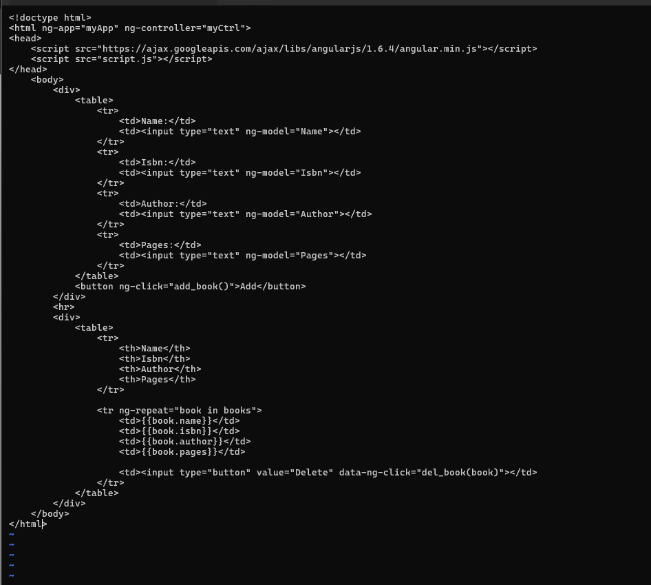<br><br>

3. change directory back to `Books`
```bash
$ cd ..
```

4. Start the server 
```bash
node server.js 
```
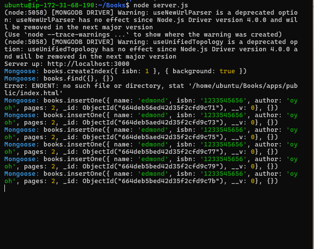<br><br>

5. Access the Book Register web application from the internet with a browser using:

```bash
http://server-public-ip:3000
```
<br><br>

<br><br>


## Conclusion
Congratulations! We have successfully set up and deployed a simple Book Register web form using the MEAN stack. This application allows you to add, view, and delete books from a MongoDB database through a web interface powered by AngularJS.